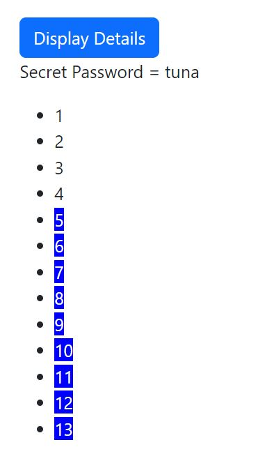

# 🔥 The Third Angular Assignment




- Crearing Angular Components ✔️
- Using String Interpolation , Event Binding , Two-Way Data Binding  ✔️

## 🔥 Steps

- ### Add A button which says 'Display Details'
- [section1.component.html](./src/app/section1/section1.component.html)
```
<button (click)="toggleSecretVisibility()" class="btn btn-primary">
  Display Details
</button>
```

- ### Add a paragraph with any content of your choice (e.g. 'Secret Password = tuna')
- ### Toggle the displaying of that paragraph with the button created in the first step
- [section1.component.html](./src/app/section1/section1.component.html)
```
<p *ngIf="isSecretVisible">Secret Password = tuna</p>
```

- ### Log all button clicks in an array and output that array below the secret paragraph (maybe log a timestamp or simply an incrementing number)
- ### Starting at the 5th log item, give all future log items a blue background (via ngStyle) and white color (ngClass)
- [section1.component.html](./src/app/section1/section1.component.html)
```
<ul>
  <li *ngFor="let click of buttonClicks">
    <span
      [ngStyle]="{ 'background-color': click >= 5 ? 'blue' : 'transparent' }"
      [ngClass]="{ text: click >= 5 }"
      >{{ click }}</span
    >
  </li>
</ul>
```

- [section1.component.ts](./src/app/section1/section1.component.ts)
```
export class Section1Component {
  isSecretVisible:boolean = false;
  buttonClicks:number[] = [];
  toggleSecretVisibility () {
    this.isSecretVisible = !this.isSecretVisible;
    this.buttonClicks.push(this.buttonClicks.length + 1);
  }
}
```

💙 You can view my different projects and contact me through my [Website📱](https://karimali.vercel.app/) 💙


